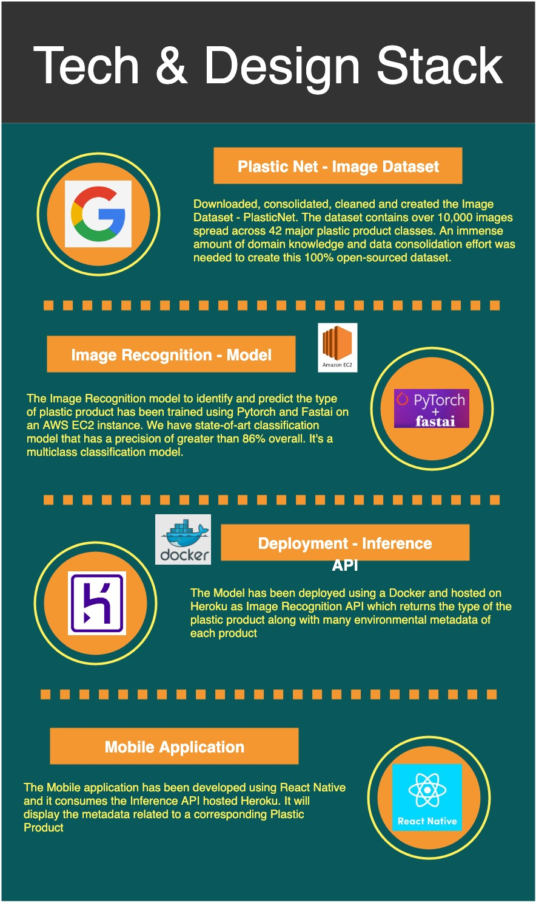
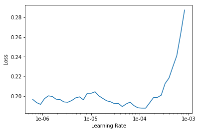
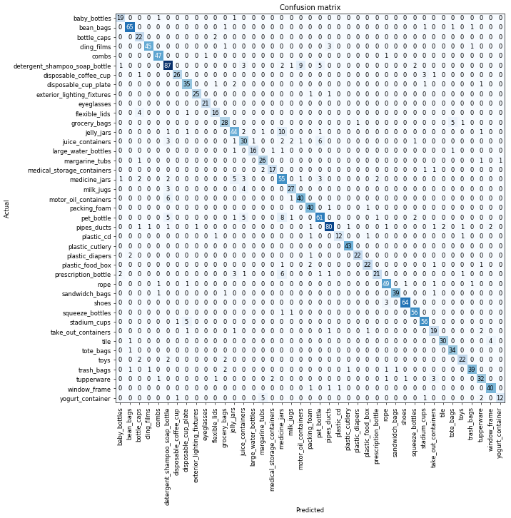

# Know Your Plastics
### An Image Recognition & Deep Learning application built on Plastic-Net Dataset
An environmental awareness mobile app that helps you to identify your plastic product and provide it's environmental impact along with a bunch of metrics that you would impact the choices you make in usage of plastics in daily life - in which you eat, drink, store, wear, and dispose. Using state-of-the-art Image Recognition and Deep Learning techniques, we have created an open source api that predicts the type of plastic product given it's image and provides various metadata related to the product in terms of environmental awareness. We use the same API to power this effective daily-usage mobile application. 

## Problem Statement 
Plastic makes up about 20% of landfill garbage, and less than 10% of them are recycled each year. Plastics are non-biodegradable; when degraded through chemical means or burning, they release toxic and carcinogenic substances, posing substantial threats to the environment. To understand and keep track of the plastic we use daily, we trained a deep learning model (transfer learning with ResNet 50) on over 10,000 images of 43 types of common plastic products. Through taking a photo or directly updating a photo from the album, the user will learn the type of plastic the product belong to, the properties and carbon footprint of the product and its potential damage to the environment.

## Mobile App Github Link
https://github.com/clairelu123/knowyourplastic_mobile

## Tech and Design Stack 


## PlasticNet - Image Dataset
We based our deep learning application on our self-collected Image Dataset - PlasticNet. We have open sourced this dataset and anyone could use it for Image Recognition Purposes. Please download the dataset from this link - https://drive.google.com/file/d/1E9R4fRIOrCZloTRwIqvLoJpi1sMNjALL/view?usp=sharing
Classes and Data Dictionary - https://drive.google.com/file/d/1mf61dPkVTYJFG6U1QkwjWJKwDo-FYK9U/view?usp=sharing

## Model Training
### Libraries Needed
 
The model training has been done on AWS EC2 P2.2xlarge instance. The libraries need for training are found in the requirements.txt file
### Training the ResNet50 Model 
### Training Time
We used the Resnet-50 CNN architecture.  The model took around 30 minutes to train on the AWS EC2 instance
### Training the Deep Learning Model
The code used for training the data is available in the same repository in the notebook [plastic_net.ipynb](https://github.com/cnll0075/knowYourPlastic/blob/master/model_Training/plastic_net.ipynb)  
We use `ImageDataBunch` to read in the images.  This Python class does the following:
- specifies the path where the images are located
- uses the default transformation of images
- sets the image size to 224
- sets batch size to 64
- normalizes the images
```python
path = Path('master_dataset')
data = ImageDataBunch.from_folder('master_dataset/', 
                                  ds_tfms=tfms, size=224, bs = bs).normalize(imagenet_stats)
```
The data is trained on a pre-trained model, resnet50, and we run the `learner` to determine the optimal learning rate. 
```python
learn = cnn_learner(data, models.resnet50, metrics=error_rate)
learn.lr_find()
learn.recorder.plot()
```
In our case, a learning rate of 7e-3 works well
```python
lr = 7e-3
```
Next, we fit 10 epochs using our learning rate of 7e-3 slicing it, and we observe our error rate drop from 25% to 17.2%.  
```bash
epoch   train_loss  valid_loss  error_rate  time
0   1.995564    0.911749    0.254846    01:27
1   1.215204    0.778199    0.244584    01:16
2   0.934370    0.737539    0.230901    01:16
3   0.763754    0.674925    0.195553    01:15
4   0.614196    0.632403    0.187001    01:16
5   0.496467    0.675292    0.196693    01:16
6   0.387976    0.655288    0.181870    01:16
7   0.311057    0.610573    0.181870    01:16
8   0.239880    0.596407    0.179590    01:16
9   0.206048    0.590164    0.172748    01:1
```
#### Unfreezing the layers
Next, we unfreezed some of the last layers and looked for a new learning rate. 
```python
learn.unfreeze()
learn.lr_find()
learn.recorder.plot()
```



#### More training
We trained the data for 10 more epochs, which reduced our error rate from 17.3% to 15.3%.
```python
learn.fit_one_cycle(10, max_lr=slice(1e-5,1e-4))
```
```bash
epoch   train_loss  valid_loss  error_rate  time
0   0.193947    0.590383    0.173888    01:37
1   0.188139    0.602298    0.171608    01:37
2   0.175330    0.591127    0.169897    01:37
3   0.167542    0.611015    0.173318    01:37
4   0.142691    0.600457    0.167047    01:37
5   0.121111    0.592816    0.163056    01:37
6   0.095959    0.596412    0.159065    01:38
7   0.094757    0.589163    0.161345    01:37
8   0.078560    0.590942    0.157355    01:37
9   0.068827    0.587435    0.153934    01:37
```

#### Confusion matrix


#### Output from the Deep Learning Model
The output of the deep learning model is a pickled file including the model and the data bunch object.  The file is called `resnet50_plasticnet.pkl`
You can download the file here - https://drive.google.com/file/d/11c26kT9so03R1d1vc27ZHGJ9M9Zg4wHc/view?usp=sharing
The file may be too large to be included in the git commit.  There are various options for proceeding with that size dataset:  
1.  Store the model on google drive.
2.  Store the model on GitHub releases.
3.  Store the model on a bucket in the cloud.  
